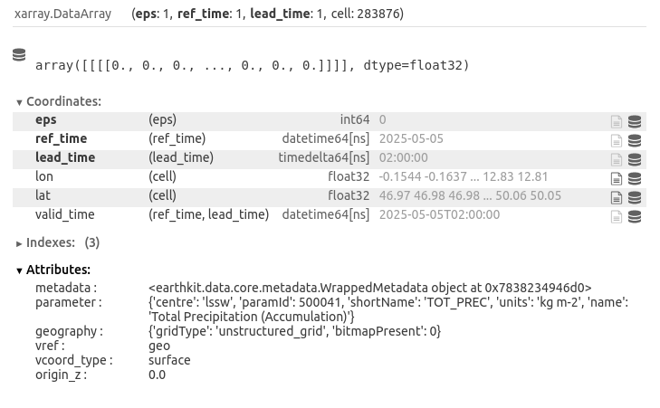

Usage
=====

.. default-role:: py:obj

Using `~meteodatalab.ogd_api` to access ICON-CH1/2-EPS forecasts
----------------------------------------------------------------

The `~meteodatalab.ogd_api` module provides a Python interface to the `STAC search API <https://data.geo.admin.ch/api/stac/static/spec/v1/api.html>`_ on data.geo.admin.ch.
It enables querying and retrieving numerical weather prediction (NWP) data from **MeteoSwiss**, published through Switzerland’s `Open Government Data (OGD) initiative <https://www.meteoswiss.admin.ch/services-and-publications/service/open-data.html>`_ and extended for forecast-specific access.

You can find interactive Jupyter notebooks demonstrating the usage of `~meteodatalab.ogd_api` here: `MeteoSwiss Open Data NWP Demos <https://github.com/MeteoSwiss/opendata-nwp-demos>`_.

This example walks you through creating requests and retrieving forecast data.

Step 1: Build requests
~~~~~~~~~~~~~~~~~~~~~~

Use `ogd_api.Request <meteodatalab.ogd_api.Request>` to define a query, for example, to retrieve ICON-CH2-EPS total precipitation.

.. code-block:: python

    from datetime import datetime, timezone
    from meteodatalab import ogd_api

    req = ogd_api.Request(
        collection="ogd-forecasting-icon-ch2",
        variable="TOT_PREC",
        reference_datetime="latest",
        perturbed=False,
        horizon=f"P0DT2H"
    )

Each argument in the request serves the following purpose:

+-------------------------+------------------------------------------------------------------------------------------------------------------------+
| Argument                | Description                                                                                                            |
+=========================+========================================================================================================================+
| ``collection``          | Forecast collection to use.                                                                                            |
|                         |                                                                                                                        |
|                         | Examples:                                                                                                              |
|                         | - ``"ogd-forecasting-icon-ch1"`` (ICON-CH1-EPS)                                                                        |
|                         | - ``"ogd-forecasting-icon-ch2"`` (ICON-CH2-EPS)                                                                        |
+-------------------------+------------------------------------------------------------------------------------------------------------------------+
| ``variable``            | Meteorological variable of interest.                                                                                   |
|                         |                                                                                                                        |
|                         | Example: ``"TOT_PREC"`` for total precipitation.                                                                       |
+-------------------------+------------------------------------------------------------------------------------------------------------------------+
| ``reference_datetime``  | Initialization time of the forecast in **UTC**, provided as one of the following:                                      |
|                         |                                                                                                                        |
|                         | - `datetime.datetime`_ object                                                                                          |
|                         |   (e.g., ``datetime.datetime(2025, 5, 5, tzinfo=datetime.timezone.utc)``)                                              |
|                         | - `ISO 8601 datetime string`_ (e.g., ``"2025-05-05T00:00:00Z"``)                                                       |
|                         | - ``"latest"`` to automatically select the most recent forecast based on the                                           |
|                         |   ``reference_datetime`` embedded in each individual asset URL (i.e., for a single                                     |
|                         |   combination of collection, variable, reference time, and horizon).                                                   |
|                         |                                                                                                                        |
|                         |   **Note:** When using ``"latest"``, the selected reference time may vary across separate                              |
|                         |   requests or files, depending on when they are executed while new data is being                                       |
|                         |   progressively pushed to the STAC API (i.e., assets are not published all at once).                                   |
+-------------------------+------------------------------------------------------------------------------------------------------------------------+
| ``perturbed``           | If ``True``, retrieves ensemble forecast members.                                                                      |
|                         | If ``False``, returns the deterministic (control) forecast.                                                            |
+-------------------------+------------------------------------------------------------------------------------------------------------------------+
| ``horizon``             | Forecast lead time, provided as one of the following:                                                                  |
|                         |                                                                                                                        |
|                         | - `datetime.timedelta`_ object (e.g., ``datetime.timedelta(hours=2)``)                                                 |
|                         | - `ISO 8601 duration string`_ (e.g., ``"P0DT2H"``)                                                                     |
+-------------------------+------------------------------------------------------------------------------------------------------------------------+

Step 2: Retrieve forecasts
~~~~~~~~~~~~~~~~~~~~~~~~~~

To access the forecast data, you have two choices:

1. Load forecast data to Xarray with `~meteodatalab.ogd_api.get_from_ogd`
2. Download forecast data with `~meteodatalab.ogd_api.download_from_ogd`

**1. Load forecast data to Xarray**

We now send our request to the API and retrieve the resulting dataset using the `~meteodatalab.ogd_api.get_from_ogd` function. The response is returned as an `xarray.DataArray`, which is efficient for handling multi-dimensional data.

.. hint::

    You can use configure caching behaviour in `earthkit-data <https://earthkit-data.readthedocs.io/en/latest/>`_ to avoid re-downloading files:

    * ``"off"`` (default): no caching — files are always freshly downloaded
    * ``"temporary"``: auto-cleared after the session
    * ``"user"``: saves to a specific directory across sessions

    See the `earthkit-data caching documentation <https://earthkit-data.readthedocs.io/en/latest/examples/cache.html>`_ for more details.

.. code-block:: python

    from earthkit.data import config

    # Enable temporary cache
    config.set("cache-policy", "temporary")

    # Load data as xarray.DataArray
    da = ogd_api.get_from_ogd(req)

**2. Download forecast data**

.. code-block:: python

    from pathlib import Path

    # Define the target directory for saving the forecast files
    target_dir = Path.cwd() / "forecast_files"

    # Download the forecast files
    ogd_api.download_from_ogd(req, target_dir)

    # List all downloaded files in the target directory
    print("Downloaded files:")
    for file in sorted(target_dir.iterdir()):
        print(f" - {file.name}")

After downloading, you should find the following files inside the ``forecast_files/`` directory:

- ``horizontal_constants_icon-ch2-eps.grib2``
- ``horizontal_constants_icon-ch2-eps.sha256``
- ``icon-ch2-eps-<today's-datetime>-2-tot_prec-ctrl.grib2``
- ``icon-ch2-eps-<today's-datetime>-2-tot_prec-ctrl.sha256``
- ``vertical_constants_icon-ch2-eps.grib2``
- ``vertical_constants_icon-ch2-eps.sha256``

.. warning::

    **Missing grid coordinates**

    Forecast GRIB files like ``icon-ch2-eps-*.grib2`` do **not** include horizontal or vertical coordinates (longitude, latitude, or height).
    Therefore, the horizontal and vertical constants are provided as separate files to fully describe the forecast grid. This applies when using
    `~meteodatalab.ogd_api.download_from_ogd`. If you use `~meteodatalab.ogd_api.get_from_ogd`, the horizontal coordinates are automatically loaded
    and included as part of the `xarray.DataArray`.

.. hint::

    **Checksum verification**

    During the download, each file’s integrity is verified using a SHA-256 checksum provided via HTTP headers.
    These checksums are saved as ``.sha256`` files and used to skip re-downloading valid existing files.

    Learn more about the data structure `here <https://opendatadocs.meteoswiss.ch/e-forecast-data/e2-e3-numerical-weather-forecasting-model>`_.

.. _datetime.datetime: https://docs.python.org/3/library/datetime.html#datetime-objects
.. _datetime.timedelta: https://docs.python.org/3/library/datetime.html#timedelta-objects
.. _ISO 8601 datetime string: https://en.wikipedia.org/wiki/ISO_8601#Combined_date_and_time_representations
.. _ISO 8601 duration string: https://en.wikipedia.org/wiki/ISO_8601#Durations
